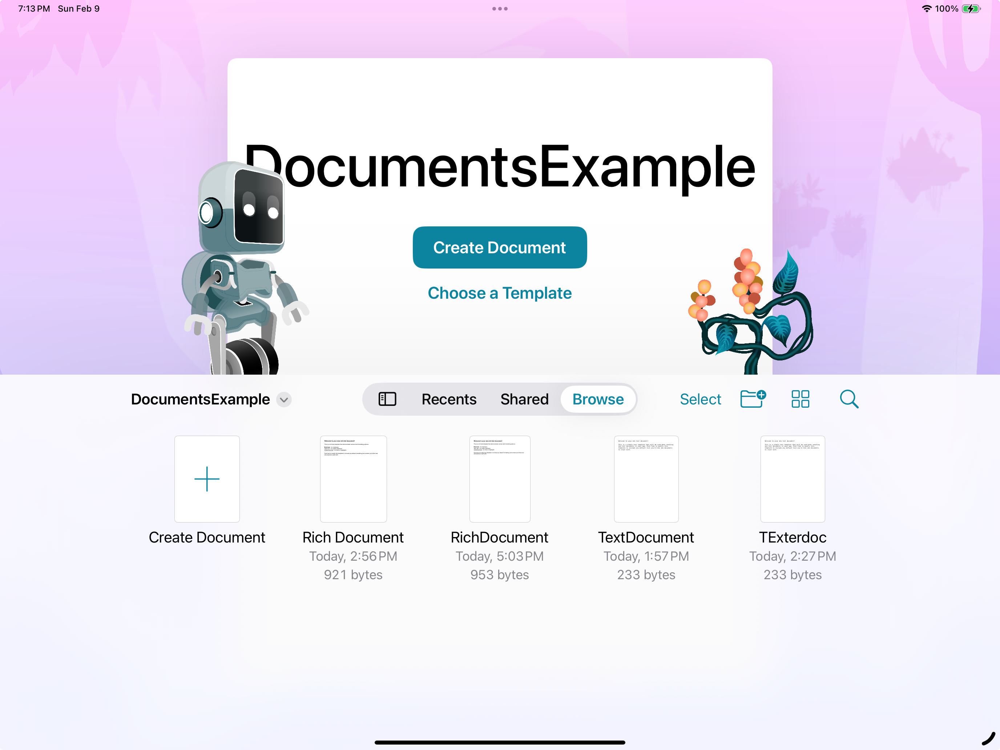

# Enhanced Document Browser Example

A sample project demonstrating the new document launch experience in iOS 18, showcasing UIKit's enhanced `UIDocumentViewController` capabilities with custom launch options and multiple document type support.

## Features

- 🚀 Enhanced document launch experience with iOS 18's built-in browser
- 🎨 Custom artwork and background support in document browser
- 📄 Multiple document type handling (Text and Rich Text)
- ↩️ Built-in undo management for documents
- 🖥️ Mac Catalyst support (with known limitations)

## Requirements

- iOS 18.0+
- Xcode 15.0+
- Swift 5.0+

## Document Types Supported

### Text Documents
- Plain text files with basic editing capabilities
- File extension: `.exampletext`

### Rich Documents
- Rich text format with enhanced formatting options
- File extension: `.sampledoc`

## Implementation Highlights

### Modern Document Browser

The app uses the new iOS 18 document browser implementation, which simplifies the setup process and provides a more refined user experience. The browser includes:

- Custom background artwork
- Decorative accessory views with SwiftUI integration
- Support for multiple document types
- Enhanced template support

### Document Management

Each document type (`TextDocument` and `RichDocument`) includes:
- Built-in undo management
- Auto-save functionality
- Custom UI for editing

### Mac Catalyst Support

While the app supports Mac Catalyst, there are some known limitations:
- UI scaling differences between platforms
- Template handling variations
- Platform-specific UI adjustments needed

## Getting Started

1. Clone the repository
2. Open `DocumentsExample.xcodeproj` in Xcode 15 or later
3. Build and run on iOS 18.0+ device or simulator

## Resources

For more information about document-based apps in UIKit, check out these resources:

- [Evolve your document launch experience (WWDC24)](https://developer.apple.com/videos/play/wwdc2024/10132/)
- [Build better document-based apps (WWDC23)](https://developer.apple.com/videos/play/wwdc2023/10056/)
- [Customizing a document-based app's launch experience](https://developer.apple.com/documentation/UIKit/customizing-a-document-based-app-s-launch-experience)

## License

This project is available under the MIT license. See the LICENSE file for more info.

## Contributing

Contributions are welcome! Please feel free to submit a Pull Request. 
